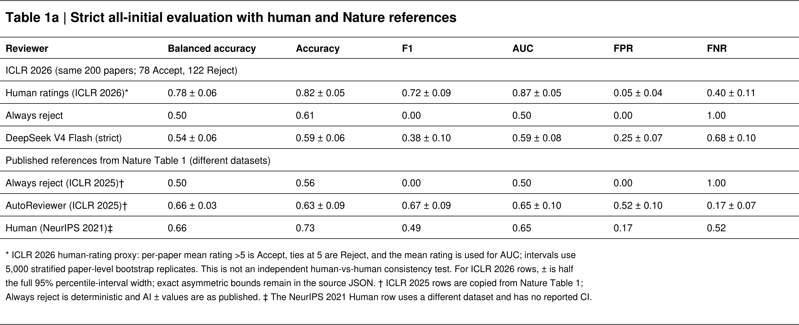
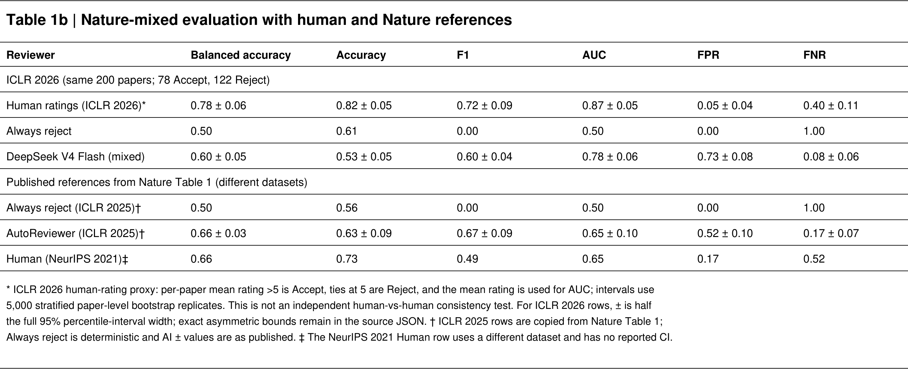
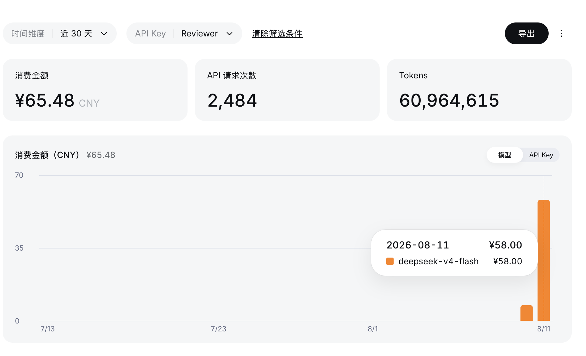

[English](./AUTOREVIEW_REPORT.en.md) | **简体中文**

# AutoReviewer 复现报告

## 执行摘要

本研究在固定的 200 篇 ICLR 2026 论文队列上评估 DeepSeek V4 Flash 对
《Towards end-to-end automation of AI research》中 AutoReviewer 组件的复现。
队列包含 78 篇最终 Accept 和 122 篇明确 Reject。

报告包含两次已完成实验。严格实验对两类论文都使用初投稿文本，并移除身份和
决定状态线索。Nature 对齐混合版本实验对 Accept 使用官方 camera-ready 文本，
对 Reject 使用初投稿文本，同时还改变了 prompt 和 DeepSeek 请求策略。因此，
两次实验描述的是不同运行条件，不能单独识别论文修订版本带来的影响。

## 实验条件

| 组件 | 严格全初投稿 | Nature 对齐混合版本 |
|---|---|---|
| 论文 ID 与标签 | 同一 B001–B200；78 Accept / 122 Reject | 同一 B001–B200；78 Accept / 122 Reject |
| Accept 输入 | ProReviewer 初投稿 Markdown | ICLR 2026 官方 proceedings PDF，经 PyMuPDF 逐页提取文本 |
| Reject 输入 | ProReviewer 初投稿 Markdown | ProReviewer 初投稿 Markdown |
| 身份与生命周期线索 | 已脱敏并通过泄漏扫描 | 稿件文本中可见的线索均保留 |
| 类别输入格式 | 两类均为 Markdown 衍生文本 | Accept 为 PDF 纯文本；Reject 为 Markdown |
| Reviewer prompt | 本地严格 JSON schema 与隔离规则 | Nature 一句基础 prompt + 冻结的完整 NeurIPS 表单 |
| 模型 | <code>deepseek-v4-flash</code> | <code>deepseek-v4-flash</code> |
| Reviewer 拓扑 | 五个独立 Reviewer + 一个 Area Chair | 五个独立 Reviewer + 一个 Area Chair |
| 推理请求 | 开启 thinking；<code>reasoning_effort=max</code> | 关闭 thinking；<code>temperature=0.75</code>；无 seed |
| 最大输出 / 尝试次数 | 16,384 tokens / 3 次 | 16,384 tokens / 3 次 |
| 模型工具 | 无 | 无 |
| 最终决定 | Area Chair 原始决定 | Area Chair 原始决定 |
| 数值结果视图 | Area Chair 原始字段 | 五个 Reviewer 算术均值并取整 |

Nature 论文确认了五审 ensemble、Area Chair 聚合、基础 prompt、无 few-shot、
无 Reflexion 和最终条件不使用 VLM。<code>temperature=0.75</code>、展开后的
完整表单文字和数值均值覆盖来自作者冻结的公开实现或本项目的供应商适配；
这些细节并不都由论文正文明确声明。

## 结果

| 指标 | 严格全初投稿 | Nature 对齐混合版本 | 混合版本 − 严格条件的配对差值（95% CI） |
|---|---:|---:|---:|
| 平衡准确率 | 0.537 | 0.597 | +0.059 [−0.012, +0.129] |
| 准确率 | 0.585 | 0.525 | −0.060 [−0.130, +0.010] |
| F1（Accept） | 0.376 | 0.603 | +0.227 [+0.129, +0.328] |
| AUROC | 0.586 | 0.784 | +0.198 [+0.129, +0.269] |
| FPR | 0.246 | 0.730 | +0.484 [+0.393, +0.574] |
| FNR | 0.679 | 0.077 | −0.603 [−0.705, −0.500] |

配对差值使用 5,000 次论文级、按真实类别分层的 percentile bootstrap，
固定 seed=2026。由于输入和协议同时发生变化，这些差值只能作描述性比较，
不能作因果解释。

### 严格全初投稿

混淆矩阵：TN=92、FP=30、FN=53、TP=25。系统预测 55 篇 Accept、145 篇
Reject。主要错误是把真实 Accept 判成 Reject，FNR=0.679。

### Nature 对齐混合版本

混淆矩阵：TN=33、FP=89、FN=6、TP=72。系统预测 161 篇 Accept、39 篇
Reject。AUROC 提高，但最终二元决定明显偏向 Accept，FPR=0.730。

## 人类评分与基线

同一队列的 ICLR 2026 Human 行是根据 775 份人类评分构造的代理指标，每篇
论文有 3–5 份评分。论文平均分大于 5 时记为 Accept；平均分恰好为 5 时记为
Reject；AUROC 使用连续的论文平均分。以会议最终决定为标签，得到：

| 平衡准确率 | 准确率 | F1 | AUROC | FPR | FNR |
|---:|---:|---:|---:|---:|---:|
| 0.777 | 0.815 | 0.718 | 0.874 | 0.049 | 0.397 |

这不是独立的人类对人类一致性实验。源数据快照包含评分，但没有每名 Reviewer
或 Area Chair 的独立二元决定。共有 41 篇论文平均分恰好为 5，因此平分规则会
显著影响二分类结果。

Nature 论文中的外部参考行是：

- <code>Always reject (ICLR 2025)</code>：0.50 / 0.56 / 0.00 / 0.50 / 0.00 / 1.00。
- <code>AutoReviewer (ICLR 2025)</code>：0.66±0.03 / 0.63±0.09 /
  0.67±0.09 / 0.65±0.10 / 0.52±0.10 / 0.17±0.07。
- <code>Human (NeurIPS 2021)</code>：0.66 / 0.73 / 0.49 / 0.65 / 0.17 / 0.52。

NeurIPS Human 行和 ICLR AutoReviewer 行来自不同会议、年份、论文池和评估结构。
Nature Methods 明确承认这种分布变化，并说明该比较并不精确。Human 行没有报告
置信区间，不代表这个估计不存在不确定性。

## API 用量与成本

### 可审计正式实验记录

| 实验 | 成功响应 | 应用层尝试 | 记录的 tokens | 估算成本 |
|---|---:|---:|---:|---:|
| 严格全初投稿 | 1,200 | 1,212 | 29,178,389 个成功响应 tokens | USD 4.61247628，可核验下界 |
| Nature 对齐混合版本 | 1,200 | 1,200 | 29,703,106 | USD 4.214517048 |

严格实验中失败尝试没有保存 usage，因此其估算不包含失败调用成本。混合版本实验
没有发生应用层重试。

### 供应商控制台

截图覆盖 API Key 别名 <code>Reviewer</code> 的近 30 天用量：¥65.48、
2,484 次 API 请求和 60,964,615 tokens。它可以作为账单侧交叉核对，但不等于
两次正式实验之和，因为其中可能包括 smoke test、重试或同一别名下的其他调用。

## 输入泄漏与解释边界

混合版本条件更接近 Nature 报告的稿件版本策略，但会暴露与标签相关的代理线索：

- Accept 使用最终 proceedings PDF，Reject 使用初投稿文本；
- Accept 和 Reject 采用不同的文本提取格式；
- camera-ready 文本可能包含作者、单位、会议页眉、标题及其他生命周期线索；
- 这些线索由实验构造决定，因此与真实标签相关。

Nature 报告直接处理 PDF 原始文本，没有报告脱敏步骤。其公开 benchmark 代码
同样不会删除 PDF 可见的标题、作者、单位或出版状态文本。因此，Nature 原始
混合版本实验和本复现都不能被解释为严格盲化的科学质量测试。

## 完整性控制

- 生成预测 bundle 时模型无法访问私有标签。
- 预测在连接标签之前冻结并提交 SHA-256。
- 每次实验包含 1,000 个 Reviewer 响应和 200 个 Area Chair 响应。
- 混合版本的 1,200 个原始响应均可解析为其保存的结构化对象。
- 所有论文的 Area Chair 原始决定都与最终决定和冻结预测一致。
- 公开结果只保存输入文本 SHA-256，不重新分发论文文本。
- 正式 Reviewer 客户端没有浏览器、搜索、RAG 或工具调用能力。

每次实验的 <code>INDEPENDENT_AUDIT.md</code>、
<code>run_manifest.json</code>、<code>frozen_predictions.json</code> 和
<code>evaluation.json</code> 位于 <code>results/</code> 下。

## 结论

DeepSeek V4 Flash 没有表现出稳定、与人类等价的同行评审能力。严格实验明显
偏向 Reject；混合版本提高了排序和 Accept 召回，但假阳性率非常高。行为发生
巨大变化说明模型对 prompt 和输入条件敏感，而不是证明 camera-ready 版本产生了
经过验证的因果效应。该系统适合作为研究原型或结构化反馈生成器，不应成为自主
接收或拒绝论文的决策者。

## 主要来源

- [Nature 正文与 Methods](https://www.nature.com/articles/s41586-026-10265-5)
- [Nature Supplementary Information](https://media.springernature.com/original/springer-static/esm/art%3A10.1038%2Fs41586-026-10265-5/MediaObjects/41586_2026_10265_MOESM1_ESM.pdf)
- [SakanaAI AI-Scientist-v2 冻结 Reviewer 实现](https://github.com/SakanaAI/AI-Scientist-v2/blob/6e8260925d17e1a0f6509751c19a9e1a481035b2/ai_scientist/perform_llm_review.py)
- [UKPLab ProReviewer Dataset](https://huggingface.co/datasets/UKPLab/ProReviewer-Dataset)
- [ICLR 2026 proceedings](https://proceedings.iclr.cc/paper_files/paper/2026)
